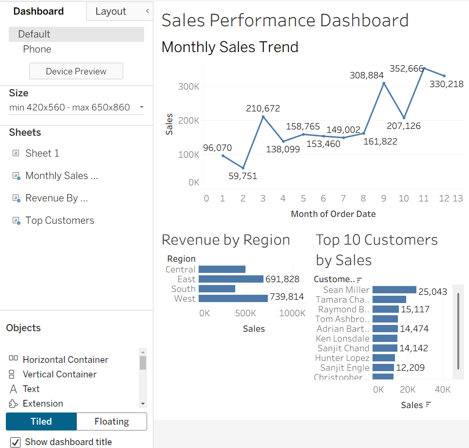

# Sales Performance Dashboard (Tableau)

## Business Problem
The goal of this project is to analyze retail sales data to identify revenue trends, top-performing regions, and high-value customers to support data-driven decision-making.

---

## Overview
This project analyzes over 10,000 sales records using SQL and Tableau to uncover key business insights and visualize performance metrics.

---

## Key Insights
- Total revenue: ~$2.3M
- Highest performing region: West
- Top customer: Sean Miller (~$25K)
- Peak sales month: November
- Sales show strong seasonal patterns toward year-end

---

## Dashboard

---

## Features
- Monthly sales trend analysis (time-series)
- Revenue comparison by region
- Top 10 customers by total sales
- Interactive filtering for deeper analysis

---

## Tools Used
- SQL (data exploration & aggregation)
- Tableau (data visualization & dashboard design)

---

## How to Use
- Download the `.twbx` file and open in Tableau Public
- Use filters (Region, Category) to explore the data
- Analyze trends, top customers, and regional performance

---

## Project Structure
- `samplesuperstore.csv` → dataset  
- `dashboard.png` → dashboard preview  
- `.twbx` → Tableau packaged workbook  
- `README.md` → documentation

---

## What I Learned
- How to transform raw data into business insights  
- Dashboard design best practices (layout, clarity, storytelling)  
- Identifying key KPIs for decision-making  
